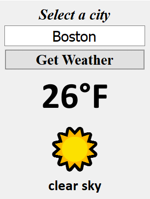
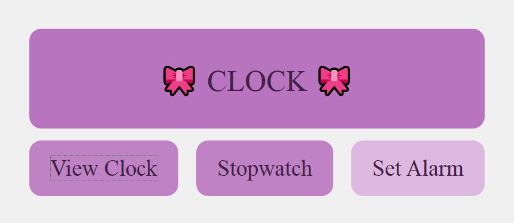
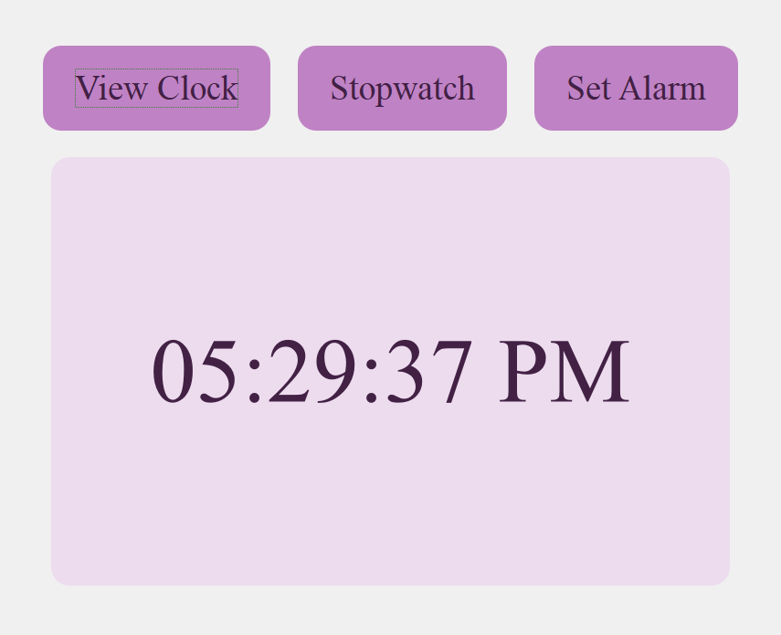
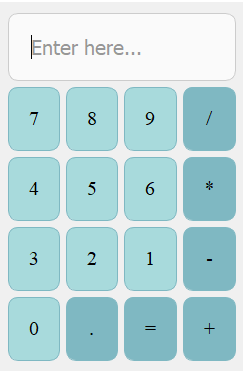
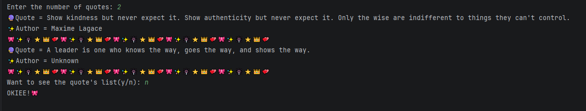

# 𝓜𝔂 𝓟𝔂𝓽𝓱𝓸𝓷 𝓙𝓸𝓾𝓻𝓷𝓮𝔂
> A collection of Python projects ranging from CLI utilities to GUI applications, built while mastering the language.

**Author:** ✧･ﾟ: * ✨ 𝑲𝒉𝒖𝒔𝒉𝒃𝒂𝒌𝒉𝒕 𝑰𝒓𝒇𝒂𝒏 ✨ *:･ﾟ✧

> ❝ Building cool things, one line of code at a time ❞
---

## 🚀 Project Gallery

<table align="center">
  <tr>
    <th align="center">Project</th>
    <th align="center">Category</th>
    <th align="center">Preview</th>
    <th align="center">Tech Stack</th>
  </tr>
  <tr>
    <td align="center"><b>🌤️ Weather App</b></td>
    <td align="center"><i>Desktop GUI</i></td>
    <td align="center">
      
    </td>
    <td>
      <code>Python</code> 
      <code>PyQt5</code> 
      <code>Requests (API)</code> 
      <code>JSON</code>
    </td>
  </tr>
  <tr>
    <td align="center"><b>🎀 Clock Suite</b></td>
    <td align="center"><i>Multi-functional Utility</i></td>
    <td align="center">
      
      
    </td>
    <td>
      <code>Python (PyQt5)</code> 
      <code>Modular Architecture</code> 
      <code>QStackedWidget</code> 
      <code>QSS Styling</code>
    </td>
  </tr>
  <tr>
    <td align="center"><b>🔢 Logic-First Calculator</b></td>
    <td align="center"><i>Desktop App</i></td>
    <td align="center">
      
    </td>
    <td>
      <code>Python (PyQt5)</code> 
      <code>Custom Parsing Engine</code> 
      <code>Order of Operations</code> 
      <code>Error Handling</code>
    </td>
  </tr>
  <tr>
    <td align="center"><b>🔮 ZenQuote Fetcher</b></td>
    <td align="center"><i>CLI Utility</i></td>
    <td align="center">
      
    </td>
    <td>
      <code>Python 3</code> 
      <code>Requests API</code> 
      <code>JSON Parsing</code> 
      <code>Input Validation</code>
    </td>
  </tr>
</table>

---

## 📂 More Projects & Experiments

  
<b>🎮 Mini Games (Terminal-Based)</b>

   
  <ul>
    <li><b>Emoji Slot Machine:</b> A betting game with randomized logic and balance tracking.</li>
    <li><b>Hangman:</b> Classic word-guessing game with visual stage progression.</li>
    <li><b>Number Guessing:</b> A logic game focused on user input validation and loops.</li>
  </ul>

  
<b>💬 Chatbots & Logic</b>

   
  <ul>
    <li><b>Mood Journal:</b> A script that logs user feelings.</li>
    <li><b>Simple Chatbot:</b> Rule-based conversational logic using string manipulation.</li>
  </ul>

  
<b>🛠️ Utilities & Tools</b>

   
  <ul>
    <li><b>Encrypt-Decrypt:</b> A security tool for encoding and decoding messages.</li>
    <li><b>Stopwatch:</b> A precise timing utility built with Python's <code>time</code> module.</li>
    <li><b>Library Management:</b> A system for tracking books.</li>
  </ul>

---

## Setup instructions:
1. **Clone the repo:** `git clone https://github.com/Khushi07tech/python-odyssey.git`
2. **Install requirements:** `pip install -r requirements.txt`
3. **Run any app:** `python apps/calculator.py`

---

## Learning Objectives:
Mastered OOP principles, worked with APIs (Weather App), and explored GUI development with PyQt5.

---

## Roadmap & Future Goals
I'm constantly learning! Here is what I plan to tackle next:
- [ ] **Database Support:** Integrate `SQLite` into the Library System for persistent storage.
- [ ] **Web Version:** Port the Weather Dashboard to the web using `Flask`.
- [ ] **UX:** Implement a theme-switcher for all PyQt5 applications.
